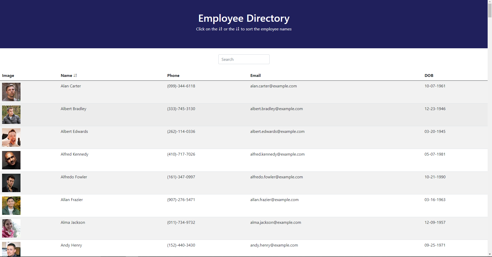

# Employee Directory
## Description
The Employee Directory is an application built using [React](https://reactjs.org/)

The applicaiton is deployed through GitHub Pages through the following link: [The Employee Directory App](https://aseppala98.github.io/Employee-Directory/)

## Table of Contents

[Description](#Description)

[Technologies-&-tools-used](#Technologies-&-tools-used)

[Local-Installation](#Local-Installation)

[Usage](#usage)

[How-it-Works](#How-it-Works)

[License](#License)

[Badges](#Badges)

[Deployed-Application](#Deployed-Application)

[Tests](#tests)

[Questions](#questions)

## Technologies & tools used
1. HTML
2. CSS
3. Bootstrap 5
4. JavaScript
5. Dependencies
    * axios
    * gh-pages
    * moment
    * react
    * readt-dom
    * react-scripts
    * web-vitals
6. [Random User API](https://randomuser.me/)

## Local Installation
To install the application locally, follow the following steps:
1. Clone the repo on your local machine
2. Run `npm install` in Visual Studio Code Integrated Terminal to install all the dependencies in the package.json
3. Run `npm start` to run the application in a development mode, Open http://localhost:3000 to view it in the browser.

## Usage
The application is used to access employee records quickly and be able to sort through the records easily. 

## How It Works
Upon opening the application the user is presented with Employee Directory where the page is divided into React components

### Header
The Header component introduces the application and its functionality

### Search
The Seach component provides the user with the ability to search through the employee directory which is fetching the employees informaiton through [Random User API](https://randomuser.me/)

### List/ Seach Results
The List/Search Results component lists the fetched employee information which enables the user to search through or sort using the Name field of the list. 

## License

## Badges

## Deployed-Application
The Employee Directory application is an application built using React and is deployed on GitHub Pages through the following link [The Employee Directory App](https://aseppala98.github.io/Employee-Directory/)

## Tests
The application is currently tested using the front-end. 

## Questions
* My repositories can be found at https://www.github.com/aseppala98
* For any questions regarding this application, you can email me at SeppalaErin98@gmail.com
